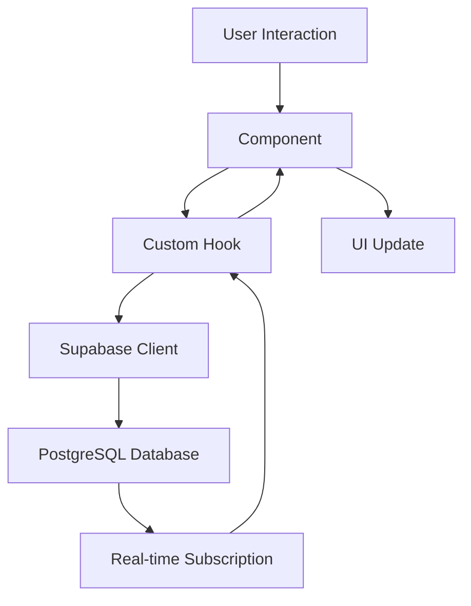

# JobRaker 😌

[](https://opensource.org/licenses/MIT)
[](https://www.typescriptlang.org/)
[](https://reactjs.org/)
[](https://vitejs.dev/)
[](https://tailwindcss.com/)
[](https://supabase.com/)

> **The world's first fully autonomous job application platform.** JobRaker leverages advanced AI to search, apply, and optimize your job hunt 24/7 while you focus on what matters most.

## 📋 Table of Contents

- [Overview](#overview)
- [Features](#features)
- [Tech Stack](#tech-stack)
- [Getting Started](#getting-started)
- [Installation](#installation)
- [Configuration](#configuration)
- [Usage](#usage)
- [Architecture](#architecture)
- [API Reference](#api-reference)
- [Development](#development)
- [Testing](#testing)
- [Deployment](#deployment)
- [Contributing](#contributing)
- [License](#license)
- [Support](#support)

## 🎯 Overview

JobRaker is an enterprise-grade autonomous job application platform that revolutionizes the job search process. Built with modern web technologies, it provides a comprehensive suite of tools for job seekers to automate their application process, track progress, and optimize their career growth strategy.

### Key Value Propositions

- **🤖 Autonomous Application System**: Apply to 100+ relevant jobs per week automatically
- **📊 Real-time Analytics**: Track success rates, response times, and optimization insights
- **🎯 Smart Filtering**: AI ensures applications only go to legitimate, high-quality positions
- **📈 24/7 Job Hunting**: Never miss an opportunity with around-the-clock automation
- **🔍 Intelligent Matching**: 95% application accuracy with perfectly tailored submissions

## ✨ Features

### Core Functionality

#### 🔐 Authentication & Onboarding
- **Multi-provider Authentication**: Email/password, Google OAuth, LinkedIn integration
- **Smart Onboarding Flow**: Progressive profile building with industry-specific guidance
- **Secure Session Management**: JWT-based authentication with refresh token rotation

#### 📊 Dashboard & Analytics
- **Comprehensive Overview**: Real-time metrics and performance indicators
- **Application Tracking**: Detailed status monitoring for all submitted applications
- **Progress Analytics**: Visual charts showing application success rates and trends
- **Interview Scheduling**: Calendar integration for interview management

#### 🎯 Job Search & Management
- **AI-Powered Job Discovery**: Intelligent job matching based on profile and preferences
- **Advanced Filtering**: Location, salary, type, and industry-specific filters
- **Bookmark System**: Save and organize interesting opportunities
- **Application Status Tracking**: Real-time updates on application progress

#### 📝 Resume & Profile Management
- **Dynamic Resume Builder**: Multiple templates with real-time preview
- **Skills Assessment**: AI-powered skill gap analysis and recommendations
- **Experience Tracking**: Comprehensive work history and achievement management
- **Portfolio Integration**: Showcase projects and professional accomplishments

#### 💬 AI Assistant & Chat
- **Intelligent Career Guidance**: Personalized advice for resume optimization
- **Interview Preparation**: Practice questions and feedback
- **Salary Negotiation**: Data-driven compensation insights
- **Career Path Planning**: Strategic guidance for professional growth

### Advanced Features

#### 🔄 Real-time Data & Synchronization
- **Live Updates**: WebSocket-based real-time notifications
- **Cross-device Sync**: Seamless experience across all devices
- **Offline Capability**: Progressive Web App features for offline access
- **Data Persistence**: Reliable state management with automatic recovery

#### 🎨 User Experience
- **Responsive Design**: Optimized for desktop, tablet, and mobile devices
- **Dark Theme**: Professional dark UI with customizable accent colors
- **Smooth Animations**: GSAP-powered micro-interactions and transitions
- **Accessibility**: WCAG 2.1 AA compliant interface design

#### 📱 Progressive Web App
- **Installable**: Add to home screen functionality
- **Push Notifications**: Real-time alerts for job opportunities and updates
- **Background Sync**: Continuous data synchronization when offline
- **Performance Optimized**: Lighthouse score of 95+ across all metrics

## 🆕 Recent Enhancements

The following improvements were recently added during active development:

- **Skyvern Integration**: Edge functions `apply-to-jobs` and `get-run` enable automated job application workflow triggers plus polling of run status (screenshots, recording URL, parsed outputs).
- **Server-Side Enrichment**: `apply-to-jobs` auto-enriches applications with user profile details and a signed resume URL when the client omits them.
- **Run Status Polling Hook**: `useSkyvernRun` React hook for lightweight polling until a workflow run reaches a terminal state.
- **Application UX Upgrades**: Readiness badges (Profile / Resume), disabled state + progress label for Apply button, and retry toast events.
- **Resume Import & Multi-Upload**: Drag & drop and multi-file import (PDF / DOC / TXT / JSON) with automatic favorite assignment for the first resume and optional JSON metadata extraction.
- **Toast Event Bridge**: Event-based toast system lets utilities surface user feedback without prop drilling.

Related docs:
- Job sources, ingestion, LinkedIn/search controls, and secrets: see `docs/job-sources.md`.

> These updates pave the way for richer automation telemetry and faster iteration on application flows.

### Profile Data (Experiences, Education, Skills)

The dashboard Profile page now loads real-time data from three normalized tables:

Tables:
```
public.profile_experiences
public.profile_education
public.profile_skills
```

These were added via migration `20250916_add_profile_collections.sql` under `backend/supabase/migrations/`.

Each table enforces RLS (row level security) and policies limiting access to the authenticated owner (`auth.uid() = user_id`).

#### Realtime Publication
These profile tables and the core `profiles` table are included in the `supabase_realtime` publication so UI updates stream instantly across sessions.

Verify in your database:
```sql
select schemaname, tablename
from pg_publication_tables
where pubname = 'supabase_realtime'
  and tablename in ('profiles','profile_experiences','profile_education','profile_skills')
order by tablename;
```

#### Applying the Migration Locally
```bash
# From repo root
supabase start            # if not already running
supabase db push          # applies new migration files
```

#### Verifying
```sql
select table_name from information_schema.tables 
 where table_schema = 'public' 
   and table_name like 'profile_%';
```

#### Frontend Hook
The React hook `useProfileCollections` (in `src/hooks/useProfileCollections.ts`) provides:
- Loading + error state per collection
- Realtime subscriptions (Postgres changes) filtered by current user
- CRUD helpers: add / update / delete for experiences, education, skills

#### Usage Example
```tsx
import { useProfileCollections } from '@/hooks/useProfileCollections';

function ProfileSection() {
  const { experiences, addExperience } = useProfileCollections();
  if (experiences.loading) return <p>Loading...</p>;
  return (
    <div>
      {experiences.data.map(e => <div key={e.id}>{e.title}</div>)}
      <button onClick={() => addExperience({ title: 'New Role', company: 'Acme', location: 'Remote', start_date: new Date().toISOString(), is_current: true, description: '' })}>Add</button>
    </div>
  );
}
```

#### Deployment Notes
After merging these changes, ensure production database has the migration applied either by:
1. Running `supabase db push` against the remote project (with `SUPABASE_ACCESS_TOKEN` & `SUPABASE_PROJECT_REF` configured), or
2. Manually creating equivalent tables & policies through the Supabase dashboard SQL editor (paste the migration SQL).

Set environment variables in Vercel:
```
VITE_SUPABASE_URL=... # project API URL
VITE_SUPABASE_ANON_KEY=... # regenerated anon key (rotate if previously exposed)
```

> If the anon key was exposed publicly, rotate it in Supabase Dashboard → Project Settings → API → Regenerate anon key, then update Vercel & redeploy.

#### Pushing Migrations to a Remote Supabase Project
From the repo root:

```bash
# Authenticate once
supabase login

# Link this folder to your remote project
export SUPABASE_PROJECT_REF=your-project-ref   # e.g. abcdefghijklmno
supabase link --project-ref "$SUPABASE_PROJECT_REF"

# Review migration status (local vs remote)
supabase migration list

# Push pending migrations to remote
supabase db push

# Sanity-check realtime publication contains profile tables
supabase db remote commit "check-publication" --dry-run >/dev/null 2>&1 || true
```

If you previously applied migrations manually and encounter a history mismatch, prefer aligning by removing duplicate/manual changes and pushing via CLI. As a last resort, consult Supabase docs on repairing migration history.

#### Quick Smoke Test: Realtime Profile
1. Set `.env.local` with `VITE_SUPABASE_URL` and `VITE_SUPABASE_ANON_KEY` for the target project.
2. Run `npm run dev` and sign in in two different browsers (or a window + incognito).
3. On the Profile page, add a new Experience. The second session should update within a second without a refresh.
4. Update the same entry’s title; both sessions should reflect the change immediately.

### Edge Functions in this repo
Located under `supabase/functions`:

- `apply-to-jobs` — orchestrates job application automations and enrichment
- `get-run` — polls Skyvern run status (screenshots, recording URL, parsed outputs)
- `get-jobs` — lightweight read endpoint for recent job listings
- `jobs-cron` — scheduled ingestion from job sources; supports deep research
- `process-and-match` — live search/extraction pipeline with multi-source parsing
- `skyvern-webhook` — webhook handler for async callbacks

Function environment variables live in `supabase/functions/.env.example`. Set these in Supabase → Project Settings → Functions → Environment Variables:

- `SUPABASE_URL`, `SUPABASE_SERVICE_ROLE_KEY` (required for DB writes)
- `JOB_SOURCES` (JSON): controls ingestion sources; examples in `docs/job-sources.md`
- `JOBS_CRON_EXPR` (cron): schedule for `jobs-cron`
- `FIRECRAWL_API_KEY` (optional; enables deep research)
- `INCLUDE_LINKEDIN`, `INCLUDE_SEARCH` (booleans; control LinkedIn/search parsing)

## 🛠 Tech Stack

### Frontend
- **Framework**: React 18 with TypeScript
- **Build Tool**: Vite 5.4+ for lightning-fast development
- **Styling**: Tailwind CSS with custom design system
- **UI Components**: Radix UI primitives with custom styling
- **Animations**: Framer Motion + GSAP for performance-optimized animations
- **Charts**: Recharts for data visualization
- **Icons**: Lucide React icon library

### Backend & Database
- **Backend-as-a-Service**: Supabase for authentication, database, and real-time features
- **Database**: PostgreSQL with Row Level Security (RLS)
- **Authentication**: Supabase Auth with multiple providers
- **Real-time**: Supabase Realtime for live updates
- **Storage**: Supabase Storage for file management

### Development & Build Tools
- **Package Manager**: npm
- **Type Checking**: TypeScript
- **Code Quality**: Linting is not yet configured in this repo
- **Version Control**: Git with conventional commits
- **CI/CD**: Not included by default (you can add GitHub Actions later)

### Deployment & Infrastructure
- **Hosting**: Vercel for frontend deployment
- **CDN**: Global edge network for optimal performance
- **Monitoring**: Built-in analytics and error tracking
- **SSL**: Automatic HTTPS with custom domain support

## 🚀 Getting Started

### Prerequisites

Before you begin, ensure you have the following installed:

- **Node.js**: v18.0.0 or higher ([Download](https://nodejs.org/))
- **npm**: v8.0.0 or higher (comes with Node.js)
- **Git**: v2.20.0 or higher ([Download](https://git-scm.com/))

### System Requirements

- **OS**: Windows 10+, macOS 10.15+, or Linux (Ubuntu 18.04+ recommended)
- **RAM**: 4GB minimum, 8GB recommended
- **Storage**: 2GB free space for dependencies and cache
- **Network**: Stable internet connection for API access

## 📦 Installation

### 1. Clone the Repository

```bash
# Clone the repository
git clone https://github.com/mylife-as-miles/Jobraker.git

# Navigate to the project directory
cd Jobraker

# Verify Node.js installation
node --version
npm --version
```

### 2. Install Dependencies

```bash
# Install all project dependencies
npm install

# Verify installation
npm list --depth=0
```

### 3. Environment Setup

Create environment configuration files:

```bash
# Copy environment template
cp .env.example .env.local

# For development
cp .env.example .env.development

# For production
cp .env.example .env.production
```

## ⚙️ Configuration

### Environment Variables

Create a `.env.local` file in the root directory with the following variables:

```env
# Supabase Configuration
VITE_SUPABASE_URL=your_supabase_project_url
VITE_SUPABASE_ANON_KEY=your_supabase_anon_key
VITE_SITE_URL=https://jobraker-six.vercel.app

# Backend API Configuration
VITE_API_BASE_URL=https://jobraker-backend.onrender.com/api/v1

# Application Configuration
VITE_APP_NAME=JobRaker
VITE_APP_VERSION=1.0.0
VITE_APP_ENVIRONMENT=development

# Analytics & Monitoring (Optional)
VITE_ANALYTICS_ID=your_analytics_id
VITE_SENTRY_DSN=your_sentry_dsn

# Feature Flags
VITE_ENABLE_ANALYTICS=true
VITE_ENABLE_NOTIFICATIONS=true
VITE_ENABLE_REAL_TIME=true
```

### Gmail Integration

This project uses a Gmail MCP server to connect to your Gmail account. To set it up:

1.  **Initialize the submodule:**
    ```bash
    git submodule init
    git submodule update
    ```

2.  **Install dependencies:**
    ```bash
    cd backend/gmail_mcp_server
    npm install
    ```

3.  **Configure Google Cloud credentials:**
    - Follow the instructions in the `backend/gmail_mcp_server/README.md` file to get your `gcp-oauth.keys.json` file.
    - Place the `gcp-oauth.keys.json` file in the `backend/gmail_mcp_server` directory.

4.  **Authorize the application:**
    ```bash
    npm run mcp:gmail -- auth
    ```

### Backend Functions Configuration

In addition to the frontend application, this project includes backend services using Supabase Edge Functions (e.g., for cron jobs that fetch job listings). These functions have their own environment variables.

A separate example file is provided at `supabase/functions/.env.example`. To configure the backend, you should copy this file to `.env` within the same directory (`supabase/functions/.env`) and set the variables. These variables must also be set in your Supabase project's settings under "Edge Functions".

```bash
# Navigate to the functions directory
cd supabase/functions

# Copy the environment template
cp .env.example .env
```

The `.env` file will contain variables such as:
- `SUPABASE_URL`
- `SUPABASE_SERVICE_ROLE_KEY`
- `FIRECRAWL_API_KEY` (optional, for enhanced job searching)
- `JOBS_CRON_EXPR` (optional, for scheduling jobs)

See the `.env.example` file for a full list and detailed comments.

### Supabase Setup

1. **Create a Supabase Project**:
   - Visit [Supabase](https://supabase.com/)
   - Create a new project
   - Note your project URL and anon key

2. **Configure Authentication Providers**:
   ```sql
   -- Enable email authentication
   SELECT auth.enable_email_auth();
   
   -- Configure OAuth providers (optional)
   -- Google, LinkedIn, GitHub
   ```

3. **Set up Database Schema**:
  Schema and migrations are generated directly via the Supabase CLI.

  - Author your schema in `backend/supabase/schema.sql`, or create tables in the local DB and diff.
  - Use these scripts from the repo root:

  ```bash
  # start local stack
  npm run supabase:start

  # reset local db (drops & re-applies migrations + seed)
  npm run supabase:reset

  # generate a migration from current DB state vs schema paths (adds a timestamped file under migrations/)
  npm run supabase:diff

  # dump the public schema into schema.sql (single source of truth for config.toml)
  npm run supabase:schema:dump

  # one-shot: generate migration (if any) and dump schema
  npm run supabase:schema:sync
  ```

   Notes:
  - The CLI is configured to read `schema_paths = ["./schema.sql"]` in `backend/supabase/config.toml`.
  - The seed file is at `backend/supabase/seed.sql` and runs on `db reset`.
   - Auth redirects and email template (confirmation) are configured for local dev in `backend/supabase/config.toml`:
     - `site_url` and `additional_redirect_urls` include `https://jobraker-six.vercel.app`
     - Custom confirmation email template at `backend/supabase/templates/confirm.html`
   - In production, set these in Supabase Dashboard → Authentication → URL Configuration and Email Templates.

### Tailwind CSS Configuration

The project includes a comprehensive Tailwind configuration with:

- **Custom Color Palette**: Professional dark theme with green accents
- **Responsive Breakpoints**: Mobile-first design approach
- **Custom Animations**: Smooth transitions and micro-interactions
- **Design Tokens**: Consistent spacing, typography, and shadows

## 🎮 Usage

### Development Server

```bash
# Start the development server
npm run dev

# Server will start on http://localhost:5173
# Hot reload enabled for instant feedback
```

### Building for Production

```bash
# Create optimized production build
npm run build

# (Optional) Preview production build locally
npx vite preview
```

### Available Scripts

```bash
# App
npm run dev                     # Start development server (Vite)
npm run build                   # Build for production

# Supabase (local stack lives under backend/supabase)
npm run supabase:start          # Start local Supabase stack
npm run supabase:stop           # Stop local stack
npm run supabase:status         # Show local stack status
npm run supabase:reset          # Drop, migrate, and seed local DB
npm run supabase:diff           # Diff DB to create a new migration file
npm run supabase:schema:dump    # Dump current schema to backend/supabase/schema.sql
npm run supabase:schema:sync    # Generate migration(s) and dump schema in one step
npm run supabase:login          # CLI login (required before linking/pushing)
npm run supabase:link           # Link this repo to a remote project (uses SUPABASE_PROJECT_REF)
npm run supabase:push           # Push migrations to the linked remote project
npm run supabase:push:dry       # Dry-run remote push
npm run supabase:push:dburl     # Push using SUPABASE_DB_URL (advanced)
npm run supabase:sync:push      # Sync schema then push migrations

# DB helpers (advanced)
npm run db:run-sql              # Run a SQL file against SUPABASE_DB_URL
npm run db:create-job-listings  # Create job_listings table via migration SQL
npm run db:create-bookmarks     # Create bookmarks via idempotent SQL
npm run db:create-core          # Create core tables (job listings + bookmarks)
```
```

### Environment notes for Vite
Development reads `VITE_`-prefixed variables from `.env.*` files. For production builds, `vite.config.ts` injects only two variables at build time:

- `VITE_SUPABASE_URL`
- `VITE_SUPABASE_ANON_KEY`

Ensure these are defined in your deployment environment (e.g., Vercel) before building.
## 🏗 Architecture

### Project Structure

```
Jobraker/
├── public/                 # Static assets
│   ├── icons/             # App icons and favicons
│   ├── images/            # Static images
│   └── manifest.json      # PWA manifest
├── src/
│   ├── components/        # Reusable UI components
│   │   ├── ui/           # Base UI components (Button, Card, etc.)
│   │   ├── analytics/    # Analytics-specific components
│   │   ├── charts/       # Data visualization components
│   │   └── examples/     # Component examples
│   ├── screens/          # Page-level components
│   │   ├── LandingPage/  # Marketing landing page
│   │   ├── Dashboard/    # Main application dashboard
│   │   ├── Analytics/    # Analytics and reporting
│   │   ├── Login/        # Authentication pages
│   │   ├── Onboarding/   # User onboarding flow
│   │   └── JobrackerSignup/ # Registration flow
│   ├── hooks/            # Custom React hooks
│   │   ├── useGSAPAnimations.ts # Animation utilities
│   │   └── useRealTimeData.ts   # Real-time data management
│   ├── lib/              # Utility libraries
│   │   ├── supabaseClient.ts # Supabase client configuration
│   │   └── utils.ts      # General utilities
│   ├── styles/           # Global styles and CSS
│   ├── utils/            # Helper functions
│   └── index.tsx         # Application entry point
├── backend/              # Backend configuration
│   └── supabase/        # Supabase local development
├── docs/                 # Documentation
├── tests/               # Test files
└── config files         # Build and tool configuration
```

### Component Architecture

#### Design System

The application follows a strict design system built on:

- **Atomic Design**: Components organized by complexity (atoms → molecules → organisms)
- **Composition Pattern**: Flexible component composition over inheritance
- **Props Interface**: Strongly typed component APIs
- **Theme System**: Consistent design tokens throughout the application

#### State Management

- **Local State**: React useState and useReducer for component-specific state
- **Global State**: Context API for application-wide state
- **Server State**: Supabase real-time subscriptions for backend data
- **URL State**: React Router for navigation and deep linking

### Data Flow



## 📡 API Reference

### Authentication Endpoints

#### Register User
```typescript
POST /api/v1/auth/register/
Content-Type: application/json

{
  "email": "user@example.com",
  "password": "securePassword123",
  "password_confirm": "securePassword123"
}

Response:
{
  "access": "jwt_access_token",
  "refresh": "jwt_refresh_token",
  "user": {
    "id": "uuid",
    "email": "user@example.com"
  }
}
```

#### Login User
```typescript
POST /api/v1/auth/login/
Content-Type: application/json

{
  "email": "user@example.com",
  "password": "securePassword123"
}

Response:
{
  "access": "jwt_access_token",
  "refresh": "jwt_refresh_token"
}
```

### User Profile Endpoints

#### Get Profile
```typescript
GET /api/v1/profile/
Authorization: Bearer {access_token}

Response:
{
  "id": "uuid",
  "email": "user@example.com",
  "first_name": "John",
  "last_name": "Doe",
  "avatar_url": "https://example.com/avatar.jpg",
  "created_at": "2024-01-01T00:00:00Z"
}
```

#### Update Profile
```typescript
PUT /api/v1/profile/
Authorization: Bearer {access_token}
Content-Type: application/json

{
  "first_name": "John",
  "last_name": "Doe",
  "avatar_url": "https://example.com/avatar.jpg"
}
```

### Job Endpoints

#### Search Jobs
```typescript
GET /api/v1/jobs/search?query=software&location=remote&limit=20
Authorization: Bearer {access_token}

Response:
{
  "jobs": [
    {
      "id": "job_uuid",
      "title": "Senior Software Engineer",
      "company": "Tech Corp",
      "location": "Remote",
      "salary": "$120,000 - $180,000",
      "description": "Job description...",
      "requirements": ["React", "TypeScript", "Node.js"],
      "posted_date": "2024-01-01T00:00:00Z"
    }
  ],
  "total": 150,
  "page": 1,
  "limit": 20
}
```

### Supabase Real-time

#### Subscribe to Application Updates
```typescript
import { createClient } from '@/lib/supabaseClient'

const supabase = createClient()

const subscription = supabase
  .channel('applications')
  .on('postgres_changes', 
    { event: '*', schema: 'public', table: 'applications' },
    (payload) => {
      console.log('Application updated:', payload)
    }
  )
  .subscribe()
```

## 🔧 Development

### Local Development Setup

1. **Start Supabase Local Development**:
   ```bash
   cd backend
   supabase start
   
   # Access local Supabase dashboard at http://localhost:54323
   ```

2. **Run Development Server**:
   ```bash
   npm run dev
   ```

3. **Access Development Tools**:
   - **Application**: http://localhost:5173
   - **Supabase Studio**: http://localhost:54323
   - **API Documentation**: http://localhost:5173/api-docs

### Code Style Guidelines

#### TypeScript Standards
- Use strict TypeScript configuration
- Define interfaces for all data structures
- Leverage type inference where appropriate
- Use generic types for reusable components

#### React Best Practices
- Functional components with hooks
- Custom hooks for shared logic
- Proper dependency arrays in useEffect
- Memoization for performance optimization

#### Styling Guidelines
- Utility-first CSS with Tailwind
- Component-scoped styles when necessary
- Consistent spacing using design tokens
- Mobile-first responsive design

### Performance Optimization

#### Bundle Optimization
- Code splitting at route level
- Dynamic imports for heavy libraries
- Tree shaking for unused code elimination
- Image optimization with next-gen formats

#### Runtime Performance
- React.memo for expensive components
- useMemo and useCallback for expensive calculations
- Virtual scrolling for large lists
- Lazy loading for images and components

#### Monitoring
- Core Web Vitals tracking
- Error boundary implementation
- Performance profiling with React DevTools
- Bundle analyzer for size monitoring

## 🧪 Testing

### Testing Strategy

#### Unit Testing
```bash
# Run unit tests
npm run test

# Run tests in watch mode
npm run test:watch

# Generate coverage report
npm run test:coverage
```

#### Integration Testing
```bash
# Run integration tests
npm run test:integration

# Test API endpoints
npm run test:api
```

#### End-to-End Testing
```bash
# Run E2E tests
npm run test:e2e

# Run E2E tests in headless mode
npm run test:e2e:headless
```

### Test Structure

```
tests/
├── __mocks__/           # Mock implementations
├── unit/               # Unit tests
│   ├── components/     # Component tests
│   ├── hooks/         # Hook tests
│   └── utils/         # Utility tests
├── integration/        # Integration tests
├── e2e/               # End-to-end tests
└── fixtures/          # Test data and fixtures
```

### Example Test

```typescript
// tests/unit/components/Button.test.tsx
import { render, screen, fireEvent } from '@testing-library/react'
import { Button } from '@/components/ui/button'

describe('Button Component', () => {
  it('should render with correct text', () => {
    render(<Button>Click me</Button>)
    expect(screen.getByText('Click me')).toBeInTheDocument()
  })

  it('should handle click events', () => {
    const handleClick = jest.fn()
    render(<Button onClick={handleClick}>Click me</Button>)
    
    fireEvent.click(screen.getByText('Click me'))
    expect(handleClick).toHaveBeenCalledTimes(1)
  })
})
```

## 🚀 Deployment

### Production Deployment

#### Vercel Deployment (Recommended)

1. **Install Vercel CLI**:
   ```bash
   npm install -g vercel
   ```

2. **Deploy to Vercel**:
   ```bash
   # Login to Vercel
   vercel login
   
   # Deploy
   vercel --prod
   ```

3. **Environment Configuration**:
   ```bash
   # Set environment variables
   vercel env add VITE_SUPABASE_URL
   vercel env add VITE_SUPABASE_ANON_KEY
   ```

#### Manual Deployment

1. **Build the Application**:
   ```bash
   npm run build
   ```

2. **Deploy to Static Hosting**:
   ```bash
   # Upload dist/ folder to your hosting provider
   # Configure redirects for SPA routing
   ```

### Production Environment Setup

#### Environment Variables
```env
# Production Environment
VITE_SUPABASE_URL=your_production_supabase_url
VITE_SUPABASE_ANON_KEY=your_production_anon_key
VITE_API_BASE_URL=https://api.jobraker.com/v1
VITE_APP_ENVIRONMENT=production
VITE_ENABLE_ANALYTICS=true
```

#### Performance Monitoring
- Set up error tracking with Sentry
- Configure performance monitoring
- Enable real user monitoring (RUM)
- Set up uptime monitoring

### CI/CD Pipeline
This repository does not include CI by default. You can add your own GitHub Actions workflow later if needed.

## 🤝 Contributing

We welcome contributions from the community! Please read our contributing guidelines before submitting pull requests.

### Getting Started

1. **Fork the Repository**
2. **Create a Feature Branch**:
   ```bash
   git checkout -b feature/amazing-feature
   ```
3. **Make Your Changes**
4. **Write Tests**
5. **Submit a Pull Request**

### Development Workflow

```bash
# 1. Clone your fork
git clone https://github.com/yourusername/Jobraker.git

# 2. Create a feature branch
git checkout -b feature/new-feature

# 3. Make changes and commit
git add .
git commit -m "feat: add amazing new feature"

# 4. Push to your fork
git push origin feature/new-feature

# 5. Create a pull request
```

### Code Review Process

1. **Automated Checks**: All PRs must pass CI/CD pipeline
2. **Code Review**: At least one maintainer review required
3. **Testing**: Comprehensive test coverage for new features
4. **Documentation**: Update documentation for user-facing changes

### Commit Convention

We use [Conventional Commits](https://conventionalcommits.org/):

```
feat: add new job search filters
fix: resolve authentication timeout issue
docs: update API documentation
style: improve button hover animations
refactor: optimize database queries
test: add unit tests for user profile
chore: update dependencies
```

### Git authorship
Commits in this repository are authored as `mylife-as-miles`. A `.mailmap` file in the repo consolidates historical authors to this identity for cleaner blame/logs.

## 📄 License

This project is licensed under the MIT License - see the [LICENSE](LICENSE) file for details.

```
MIT License

Copyright (c) 2024 JobRaker

Permission is hereby granted, free of charge, to any person obtaining a copy
of this software and associated documentation files (the "Software"), to deal
in the Software without restriction, including without limitation the rights
to use, copy, modify, merge, publish, distribute, sublicense, and/or sell
copies of the Software, and to permit persons to whom the Software is
furnished to do so, subject to the following conditions:

The above copyright notice and this permission notice shall be included in all
copies or substantial portions of the Software.

THE SOFTWARE IS PROVIDED "AS IS", WITHOUT WARRANTY OF ANY KIND, EXPRESS OR
IMPLIED, INCLUDING BUT NOT LIMITED TO THE WARRANTIES OF MERCHANTABILITY,
FITNESS FOR A PARTICULAR PURPOSE AND NONINFRINGEMENT. IN NO EVENT SHALL THE
AUTHORS OR COPYRIGHT HOLDERS BE LIABLE FOR ANY CLAIM, DAMAGES OR OTHER
LIABILITY, WHETHER IN AN ACTION OF CONTRACT, TORT OR OTHERWISE, ARISING FROM,
OUT OF OR IN CONNECTION WITH THE SOFTWARE OR THE USE OR OTHER DEALINGS IN THE
SOFTWARE.
```

## 🆘 Support

### Getting Help

- **Documentation**: Check our [comprehensive docs](https://docs.jobraker.com)
- **GitHub Issues**: [Report bugs or request features](https://github.com/mylife-as-miles/Jobraker/issues)
- **Community Discord**: [Join our community](https://discord.gg/jobraker)
- **Email Support**: support@jobraker.com

### Troubleshooting

#### Common Issues

1. **Installation Problems**:
   ```bash
   # Clear npm cache
   npm cache clean --force
   
   # Delete node_modules and reinstall
   rm -rf node_modules package-lock.json
   npm install
   ```

2. **Build Failures**:
   ```bash
   # Check Node.js version
   node --version  # Should be 18+
   
   # Clear build cache
   rm -rf dist
   npm run build
   ```

3. **Supabase Connection Issues**:
   - Verify environment variables
   - Check Supabase project status
   - Ensure API keys are correct

#### Performance Issues

- **Slow Loading**: Check network tab for large bundles
- **Memory Leaks**: Use React DevTools Profiler
- **Animation Lag**: Reduce motion for low-end devices

### Reporting Bugs

When reporting bugs, please include:

1. **Environment Details**:
   - Operating System
   - Node.js version
   - Browser version
   - Package versions

2. **Steps to Reproduce**:
   - Detailed reproduction steps
   - Expected vs. actual behavior
   - Screenshots or videos if applicable

3. **Additional Context**:
   - Console errors
   - Network requests
   - Related issues or PRs

---

## 🎉 Acknowledgments

- **Design Inspiration**: Modern job application platforms
- **Open Source Libraries**: React, TypeScript, Tailwind CSS, and many others
- **Community**: Contributors and users who make this project possible
- **Supabase**: For providing an excellent backend-as-a-service platform

---

<div align="center">
  <p>Made with ❤️ by the JobRaker Team</p>
  <p>
    <a href="https://jobraker.com">Website</a> •
    <a href="https://docs.jobraker.com">Documentation</a> •
    <a href="https://github.com/mylife-as-miles/Jobraker/issues">Issues</a> •
    <a href="https://discord.gg/jobraker">Discord</a>
  </p>
</div>
